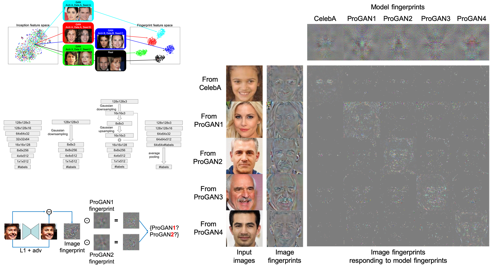

# GANFingerprints



- Official Tensorflow implementation for our [ICCV'19 paper](https://arxiv.org/pdf/1811.08180.pdf) on GAN fingerprints definition, learning, visualization, and analysis.
- Contact: Ning Yu (ningyu AT mpi-inf DOT mpg DOT de)

## Abstract
Recent advances in Generative Adversarial Networks (GANs) have shown increasing success in generating photorealistic images. But they also raise challenges to visual forensics and model attribution. We present the first study of learning GAN fingerprints towards image attribution and using them to classify an image as real or GAN-generated. For GAN-generated images, we further identify their sources. Our experiments show that:
- GANs carry distinct model fingerprints and leave stable fingerprints in their generated images, which support image attribution;
- Even minor differences in GAN training can result in different fingerprints, which enables fine-grained model authentication;
- Fingerprints persist across different image frequencies and patches and are not biased by GAN artifacts;
- Fingerprint finetuning is effective in immunizing against five types of adversarial image perturbations;
- Comparisons also show our learned fingerprints consistently outperform several baselines in a variety of setups.

## Prerequisites
- Linux
- NVIDIA GPU + CUDA + CuDNN
- Python 3.6
- tensorflow-gpu
- Other Python dependencies: numpy, scipy, moviepy, Pillow, skimage, lmdb, opencv-python, cryptography, h5py, six, chainer, cython, cupy, pyyaml

## Datasets
To train GANs and our classifiers, we consider two real-world datasets:
- [CelebA](http://mmlab.ie.cuhk.edu.hk/projects/CelebA.html) aligned and cropped face dataset. We crop each image centered at (x,y) = (89,121) with size 128x128 before training.
- [LSUN](https://github.com/fyu/lsun) bedroom scene dataset. We select the first 200k images, center-crop them to square size according to the shorter side length, and resize them to 128x128 before training.
  
## GAN sources
For each dataset, we pre-train four GAN sources: ProGAN, SNGAN, CramerGAN, and MMDGAN
- [ProGAN](https://github.com/tkarras/progressive_growing_of_gans)
  - **Data preparation**. Run, e.g.,
    ```
    cd ProGAN/
    python3 dataset_tool.py \
    create_from_images \
    datasets/celeba_align_png_cropped/ \
    ../celeba_align_png_cropped/
    ```
    where `datasets/celeba_align_png_cropped/` is the output directory containing the prepared data format that enables efficient streaming, and `../celeba_align_png_cropped/` is the training dataset directory containing 128x128 png images.
  - **Training**. Run, e.g.,
    ```
    cd ProGAN/
    python3 run.py \
    --app train \
    --training_data_dir datasets/celeba_align_png_cropped/ \
    --out_model_dir models/celeba_align_png_cropped_seed_v0/ \
    --training_seed 0
    ```
    where
    - `training_data_dir`: The prepared training dataset directory that can be efficiently called by the code.
    - `out_model_dir`: The output directory containing trained models, training configureation, training log, and training snapshots.
    - `training_seed`: The random seed that differentiates training instances.
  - **Pre-trained models**. Download our pre-trained models [here](https://drive.google.com/drive/folders/1E4Bm8xshBTDPBU3Nh8x6ASFduLZZmtVI?usp=sharing) and put them at `ProGAN/models/`. The models named with `_seed_v%d` are only different in random seeds from each other.
  - **Generation**. With a pre-trained model, generate images of size 128x128 by running, e.g.,
    ```
    cd ProGAN/
    python3 run.py \
    --app gen \
    --model_path models/celeba_align_png_cropped.pkl \
    --out_image_dir gen/celeba_align_png_cropped/ \
    --num_pngs 10000 \
    --gen_seed 0
    ```
    where
    - `model_path`: The pre-trained GAN model.
    - `out_image_dir`: The outpupt directory containing generated images.
    - `num_pngs`: The number of generated images.
    - `gen_seed`: The random seed that differentiates generation instances.
- [SNGAN](https://github.com/pfnet-research/sngan_projection)
  - **Data preparation**. Run
    ```
    cd SNGAN/datasets/
    python3 celeba.py ../../celeba_align_png_cropped/
    ```
    Or
    ```
    cd SNGAN/datasets/
    python3 lsun_bedroom_200k.py ../../lsun_bedroom_train_200k_png/
    ```
    where `../../celeba_align_png_cropped/` and `../../lsun_bedroom_train_200k_png/` are the training dataset directories containing 128x128 png images.
  - **Training**. Run, e.g.,
    ```
    cd SNGAN/
    python3 train.py \
    --config_path configs/sn_projection_celeba.yml \
    --data_dir ../celeba_align_png_cropped/ \
    --results_dir models/celeba_align_png_cropped \
    --loaderjob 32
    ```
    where
    - `config_path`: The training configuration file. The yml file for LSUN is at `configs/sn_projection_lsun_bedroom_200k.yml`.
    - `data_dir`: The training dataset directory containing 128x128 png images.
    - `results_dir`: The output directory containing trained models, training configureations, training log, and training snapshots.
    - `loaderjob`: The number of parallel data loading processes.
  - **Pre-trained models**. Download our pre-trained models [here](https://drive.google.com/drive/folders/1q9o8qToZ44WifVBRdu9LM6-DHjl3oi9f?usp=sharing) and put them at `SNGAN/models/`.
  - **Generation**. With a pre-trained model, generate images of size 128x128 by running, e.g.,
    ```
    cd SNGAN/
    python3 evaluations/gen_images.py \
    --config_path configs/sn_projection_celeba.yml \
    --snapshot models/celeba_align_png_cropped.npz \
    --results_dir gen/celeba_align_png_cropped \
    --num_pngs 10000 \
    --seed 0 \
    ```
    where
    - `config_path`: The training configuration file. The yml file for LSUN is at `configs/sn_projection_lsun_bedroom_200k.yml`.
    - `snapshot`: The pre-trained GAN model.
    - `results_dir`: The outpupt directory containing generated images.
    - `num_pngs`: The number of generated images.
    - `seed`: The random seed that differentiates generation instances.
- [CramerGAN](https://github.com/mbinkowski/MMD-GAN)
  - **Training**. Run, e.g.,
    ```
    cd CramerGAN/
    python3 gan/main.py \
    --is_train True \
    --dataset celebA \
    --data_dir ../celeba_align_png_cropped/ \
    --checkpoint_dir models/ \
    --sample_dir samples/ \
    --log_dir logs/ \
    --model cramer --name cramer_gan \
    --architecture g_resnet5 --output_size 128 --dof_dim 256 \
    --gradient_penalty 10. \
    --MMD_lr_scheduler \
    --random_seed 0
    ```
    where
    - `dataset`: The dataset ID.
    - `data_dir`: The training dataset directory containing 128x128 png images.
    - `checkpoint_dir`: The output directory containing trained models and training snapshots.
    - `sample_dir`: The output directory containing generated samples during training.
    - `log_dir`: The output directory containing training log.
    - `random_seed`: The random seed that differentiates training instances.
  - **Pre-trained models**. Download our pre-trained models [here](https://drive.google.com/drive/folders/1VpD69vknOWbRWt-qb5BryIWKs87EPRis?usp=sharing) and put them at `CramerGAN/models/cramer_gan/`.
  - **Generation**. With a pre-trained model, generate images of size 128x128 by running, e.g.,
    ```
    cd CramerGAN/
    python3 gan/main.py \
    --dataset celebA \
    --data_dir ../celeba_align_png_cropped/ \
    --checkpoint_dir models/ \
    --output_dir_of_test_samples gen/celeba_align_png_cropped/ \
    --no_of_samples 10000 \
    --model cramer --name cramer_gan \
    --architecture g_resnet5 --output_size 128 --dof_dim 256 \
    --gradient_penalty 10. \
    --MMD_lr_scheduler \
    --random_seed 0
    ```
    where
    - `output_dir_of_test_samples`: The outpupt directory containing generated images.
    - `no_of_samples`: The number of generated images.
- [MMDGAN](https://github.com/mbinkowski/MMD-GAN) (The same API as MMDGAN)
  - **Training**. Run, e.g.,
    ```
    cd MMDGAN/
    python3 gan/main.py \
    --is_train True \
    --dataset celebA \
    --data_dir ../celeba_align_png_cropped/ \
    --checkpoint_dir models/ \
    --sample_dir samples/ \
    --log_dir logs/ \
    --model mmd --name mmd --kernel mix_rq_1dot \
    --architecture g_resnet5 --output_size 128 --dof_dim 16 \
    --gradient_penalty 1. --L2_discriminator_penalty 1. \
    --MMD_lr_scheduler \
    --random_seed 0
    ```
  - **Pre-trained models**. Download our pre-trained models [here](https://drive.google.com/drive/folders/12ac3076DqMQ0tF0xexRRxm6JAYs08ZDH?usp=sharing) and put them at `MMDGAN/models/mmd/`.
  - **Generation**. With a pre-trained model, generate images of size 128x128 by running, e.g.,
    ```
    cd MMDGAN/
    python3 gan/main.py \
    --dataset celebA \
    --data_dir ../celeba_align_png_cropped/ \
    --checkpoint_dir models/ \
    --output_dir_of_test_samples gen/celeba_align_png_cropped/ \
    --no_of_samples 10000 \
    --model mmd --name mmd --kernel mix_rq_1dot \
    --architecture g_resnet5 --output_size 128 --dof_dim 16 \
    --gradient_penalty 1. --L2_discriminator_penalty 1. \
    --MMD_lr_scheduler \
    --random_seed 0
    ```

## GAN classifier
Given images of size 128x128 from real dataset or generated by different GANs, we train a classifier to attribute their sources. The code is modified from [ProGAN](https://github.com/tkarras/progressive_growing_of_gans).
- **Data preparation**. Run, e.g.,
  ```
  cd classifier/
  python3 data_preparation.py \
  --in_dir ../GAN_classifier_datasets/train/ \
  --out_dir datasets/train/
  ```
  where
  - `in_dir`: The input directory containing subdirectories of images. Each subdirectory represents a data source, either from the real dataset or generated by a GAN.
  - `out_dir`: The output directory containing the prepared data format and its source label format that enable efficient streaming.
- **Training**. Run, e.g.,
  ```
  cd classifier/
  python3 run.py \
  --app train \
  --training_data_dir datasets/training/ \
  --validation_data_dir datasets/validation/ \
  --out_model_dir models/GAN_classifier/ \
  --training_seed 0
  ```
  where
  - `training_data_dir`: The prepared training dataset directory that can be efficiently called by the code.
  - `validation_data_dir`: The prepared validation dataset directory that can be efficiently called by the code.
  - `out_model_dir`: The output directory containing trained models, training configureation, training log, and training snapshots.
  - `training_seed`: The random seed that differentiates training instances.
- **Pre-trained models**. Download our pre-trained models [here](https://drive.google.com/drive/folders/1gbfUjHsjs8929cas-8TRsBtQaJKLcXXC?usp=sharing) and put them at `classifier/models/`. They separately apply to the two datasets and differentiate either from the 5 sources (1 real + 4 GAN architectures) or from the 11 sources (1 real + 10 ProGANs pre-trained with different random seeds).
- **Testing**. Run, e.g.,
  ```
  cd classifier/
  python3 run.py \
  --app test \
  --model_path models/CelebA_ProGAN_SNGAN_CramerGAN_MMDGAN_128.pkl \
  --testing_data_path ../GAN_classifier_datasets/test/
  ```
  where
  - `model_path`: The pre-trained GAN model.
  - `testing_data_path`: The path of testing image file or the directory containing a collection of testing images. There is no need to execute data preparation for testing image(s).
  
## GAN classifier visNet variant (fingerprint visualization)
This is another variant from the above regular GAN classifier. Given images of size 128x128 from real dataset or generated by different GANs, besides training a classifier to attribute their sources, we simultaneously learn to expose fingerprints for each image and for each source. The fingerprints are also in the size of 128x128. The code is modified from [ProGAN](https://github.com/tkarras/progressive_growing_of_gans) and has a similar API to the above regular GAN classifier.
- **Data preparation**. Run, e.g.,
  ```
  cd classifier_visNet/
  python3 data_preparation.py \
  --in_dir ../GAN_classifier_datasets/train/ \
  --out_dir datasets/train/
  ```
- **Training**. Run, e.g.,
  ```
  cd classifier_visNet/
  python3 run.py \
  --app train \
  --training_data_dir datasets/training/ \
  --validation_data_dir datasets/validation/ \
  --out_model_dir models/GAN_classifier/ \
  --training_seed 0
  ```
- **Pre-trained models**. Download our pre-trained models [here](https://drive.google.com/drive/folders/1LE_h8KToDllX9R-Fii5QxNYg-Cmded3_?usp=sharing) and put them at `classifier_visNet/models/`.
- **Testing**. Run, e.g.,
  ```
  cd classifier_visNet/
  python3 run.py \
  --app test \
  --model_path models/CelebA_ProGAN_SNGAN_CramerGAN_MMDGAN_128.pkl \
  --testing_data_path ../GAN_classifier_datasets/test/ \
  --out_fingerprint_dir fingerprints/GAN_classifier_visNet/
  ```
  where
  - `out_fingerprint_dir`: The output directory containing model fingerprints, image fingerprint(s), and image fingerprints masked(re-weighted) by each model fingerprint.

## Citation
```
@inproceedings{yu2019attributing,
    author = {Yu, Ning and Davis, Larry and Fritz, Mario},
    title = {Attributing Fake Images to GANs: Learning and Analyzing GAN Fingerprints},
    booktitle = {IEEE International Conference on Computer Vision (ICCV)},
    year = {2019}
}
```

## Acknowledgement
- This research is partially funded by DARPA MediFor program under cooperative agreement FA87501620191.
- We acknowledge the Maryland Advanced Research Computing Center for providing computing resources.
- We thank Hao Zhou for helping with the relighting experiments.
- We also thank Yaser Yacoob and Abhinav Shrivastava for constructive advice in general.
- We express gratitudes to the [ProGAN](https://github.com/tkarras/progressive_growing_of_gans) repository as we benefit a lot from their code.
